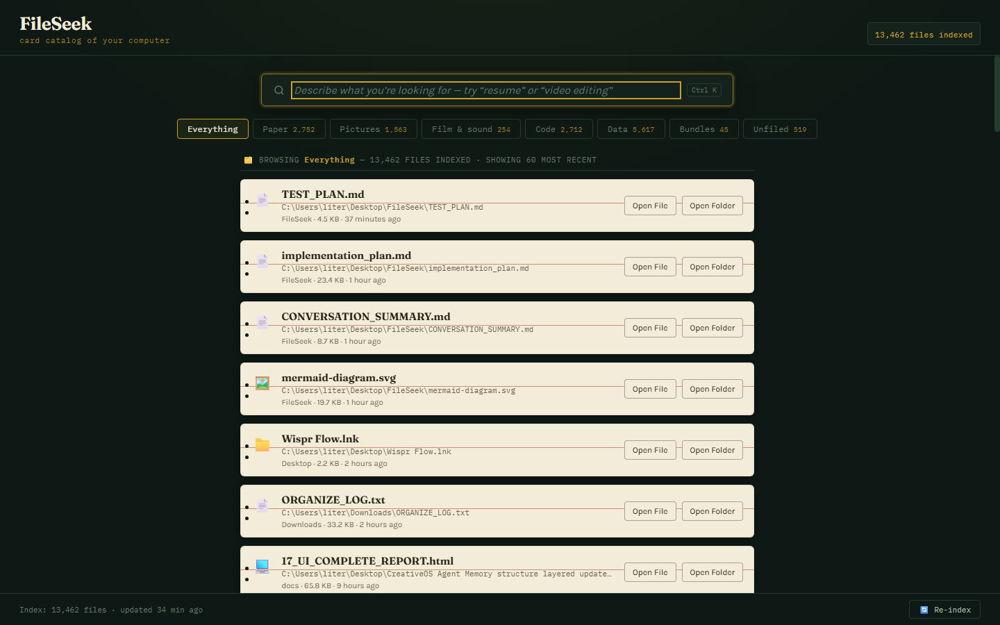
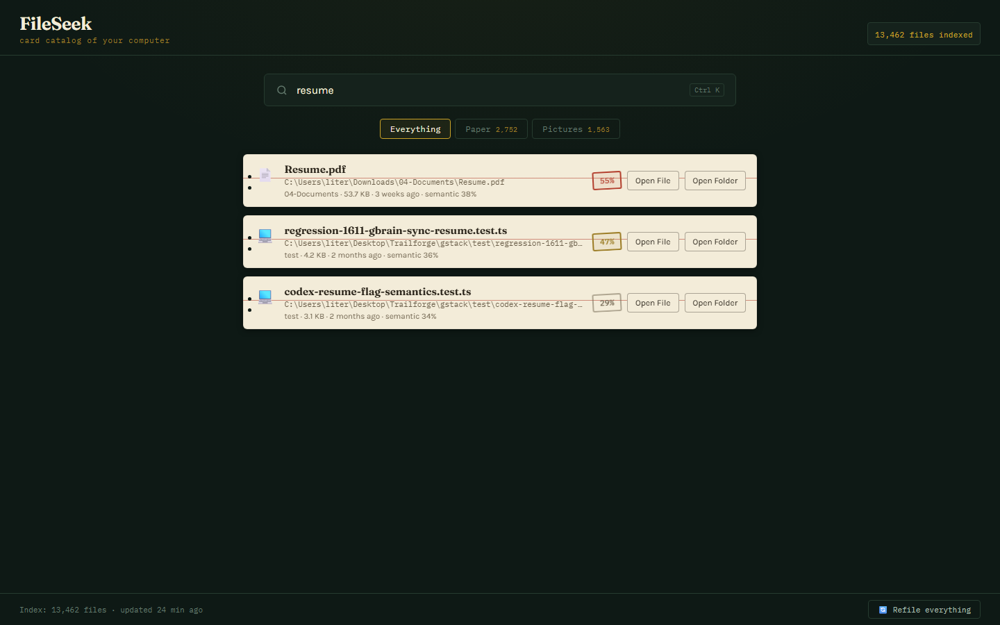
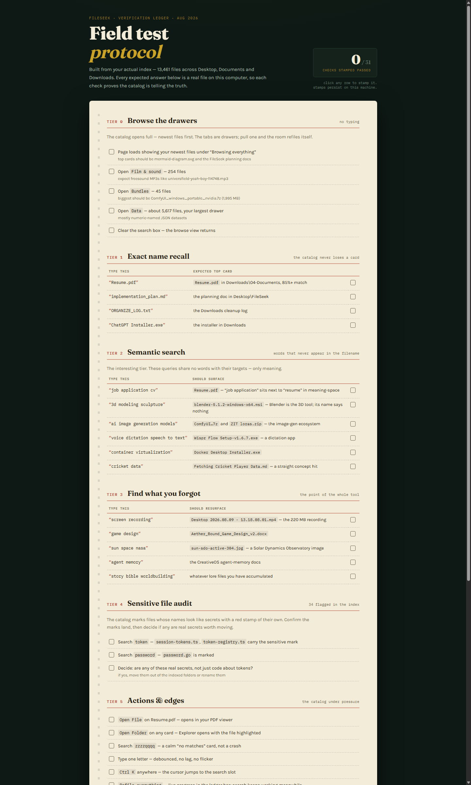

# FileSeek

**A card catalog for your computer.** Search your files by *meaning*, not by name —
the index updates itself as files change, and a local AI can explain any file it
finds. 100% local, 100% private.

`13,526 files indexed` · `searches answer in 8–10 ms` · `0 bytes leave your machine`



> “Think of it like a library card catalog, but instead of alphabetical order,
> it’s organized by *meaning*.” — from the original design doc

---

## The problem it solves

Windows Explorer only finds files whose **names** contain your words. But you don’t
remember names — you remember *intent*. You type `resume`; your file is called
`CV.pdf`. Explorer finds nothing. FileSeek finds it, because in its index,
“resume” and “CV” live next to each other.

Every file’s name, parent folder and type is converted into a 384-number
“meaning fingerprint” (an embedding) by a tiny on-device model
(`all-MiniLM-L6-v2`, ~22 MB), stored in a FAISS index, and searched in
milliseconds.

Real queries, real results, from the verification run on this machine:

| You type | The catalog pulls out | Why |
|---|---|---|
| `resume` | `Resume.pdf` — stamped 55% | exact + semantic agreement |
| `job application cv` | `Resume.pdf` | no shared words, same meaning |
| `cricket data` | `Fetching Cricket Player Data.md` | straight concept hit |
| `installer` | `ChatGPT Installer.exe` — 70% | literal + semantic |
| `python script` | `main.py` | type-aware semantic match |

Results also carry **how many files matched** in total, so the catalog tells you
not just *what* it pulled, but how deep the drawer goes.



---

## The room

The interface is a night-shift card catalog, because that is exactly what the
index is:

- **Drawers** — category tabs (*Paper, Pictures, Film & sound, Code, Data,
  Bundles, Unfiled*) with live file counts. Pull one and the room refiles
  itself; no typing needed.
- **Cards** — results render as aged-paper index cards: red header rule,
  punched holes, path, size, age.
- **Stamps** — search results get a tilted rubber-stamp match mark
  (red = strong, brass = fair, faded = weak). Sensitive-looking filenames
  (`*token*`, `*password*`, `*.pem*`…) carry their own red mark.
- **Ledger** — the bottom bar keeps the count and last refile time, and the
  *Refile everything* button rebuilds the index.
- **Ask** — every card carries an **Ask** button that makes a local AI explain
  the file in plain English (see below).

`Ctrl K` jumps to the search slot from anywhere.

---

## Live watcher — the catalog refiles itself

After the index loads, a `watchdog`-powered watcher takes over and keeps the
catalog current in real time:

- **Created / deleted** files are added to or removed from the index within
  seconds — no manual refile needed.
- **Changed** files get a stamped **change-diff summary** right on the card:
  *`2 lines added · 1 line removed`*, or a size delta for binary files. The
  next search shows you *what moved* since you last looked.
- Junk folders (`node_modules`, `.git`, caches…) stay unwatched by name; the
  index folder itself is excluded so FileSeek never watches itself.
- Snapshots persist to `data/snapshots.json`, so diffs survive restarts.

---

## Ask — the catalog talks back

Phase 3 gave the card catalog a librarian. Click **Ask** on any file and a local
Ollama model reads it and writes a plain-language explanation — no jargon,
honest about unknowns:

- **Code files** (`.py`, `.js`, `.ts`…) go to `qwen2.5-coder`; everything else
  to `llama3:8b`.
- **PDF and Word documents** (`.pdf`, `.docx`) get their text extracted locally
  (`pypdf` / `python-docx`) and explained like real documents (Phase 5) — only
  a corrupt file falls back to a metadata summary.
- **Very large files** are read up to the first ~8 KB; the panel says so when a
  file was truncated.
- **Binary files** (images, videos, archives…) get an instant metadata summary —
  no model call, no waiting.
- **Sensitive files** show a red *marked sensitive* stamp in the answer panel:
  reviewed locally only, nothing leaves this machine.

### Ask More — conversation with folder clues

After an answer, click **💬 Ask more** to open an inline chat about that file.
The model now also sees the room around it:

- the other files in the same folder (up to 25 siblings, names/sizes/types), and
- short excerpts from up to 3 small nearby text files (≤1.5 KB each)

…so it can deduce what a file is really for — a `metadata.json` sitting next to
model files, or a config sitting next to its script. This works for binary files
too, since those get their meaning from what is around them. History is trimmed
server-side to the last 6 turns.

### Full chat page

Click **⛶ Full chat** and FileSeek opens a dedicated ChatGPT-style conversation
page (`/chat`) for that file: file header (icon, name, path, sensitive badge),
bubble thread, composer, and an automatic first question — with the same
folder-clue context. **← catalog** walks back to the room.

### Ask requirements

- [Ollama](https://ollama.com) running locally (`ollama serve`) with
  `ollama pull llama3:8b` and `ollama pull qwen2.5-coder`
- When Ollama is down, search and the watcher are unaffected — Ask shows a
  friendly “start Ollama” card, and binary files still answer instantly.

---

## Quick start

```
1. Double-click run.bat
2. First run builds the venv and installs dependencies (needs internet once)
3. It indexes Downloads, Documents and Desktop (~20 s per 10k files)
4. Your browser opens http://127.0.0.1:7860, the watcher starts, done
```

That’s the whole ritual. Later runs load the saved index instantly.

### What your machine needs

| Requirement | Reality check |
|---|---|
| Python 3.10+ | built and verified on 3.11.15 |
| ~500 MB disk | index of 13.5k files ≈ 26 MB |
| GPU | **not required** — CPU FAISS answers in <10 ms at this scale |
| Internet | only for the one-time dependency install |
| Ollama | optional — only for Ask / Ask More (`llama3:8b`, `qwen2.5-coder`) |

---

## Inside

```
walk ──▶ embed ──▶ FAISS ──▶ rank ──▶ cards ──▶ watch ──▶ ask
crawler  embedder  index_store ranker  app.py    watcher/  assistant/
```

| Module | Job |
|---|---|
| `src/modules/core/config.py` | scan roots, skip-list, port, models, watcher + Ask caps |
| `src/modules/core/utils.py` | sizes, icons, categories, human time, excerpt decoding |
| `src/modules/indexer/crawler.py` | walks your folders, skips `node_modules`/`.git`/caches |
| `src/modules/indexer/embedder.py` | name + folder + type → 384-dim vector |
| `src/modules/indexer/index_store.py` | `IndexIDMap` over flat inner-product — incremental add/remove, used by the watcher |
| `src/modules/search/engine.py` | query → embedding → nearest neighbours + match counts |
| `src/modules/search/ranker.py` | 60% semantic · 25% exact · 10% recency · 5% size |
| `src/modules/watcher/monitor.py` | recursive `watchdog` observer, event queue, debounced batches |
| `src/modules/watcher/snapshot_store.py` + `diff.py` | file snapshots → line-level change-diff summaries |
| `src/modules/watcher/sync.py` | applies batches to the index: add / remove / re-embed |
| `src/modules/watcher/activity_log.py` | capped 200-entry feed of applied changes (`data/activity.json`) |
| `src/modules/assistant/explainer.py` | Ask: read file → pick model → plain-language answer |
| `src/modules/assistant/folder_context.py` | sibling listing + nearby-text excerpts for Ask More |
| `src/modules/assistant/llm_client.py` | Ollama client (`/api/generate` + `/api/chat`) |
| `src/app.py` | Flask server: `/api/search`, `/api/browse`, `/api/index`, `/api/ask`, `/api/ask-more`, `/chat`, open file/folder |
| `src/static/` + `src/templates/` | the card-catalog UI and the chat page |

### A bug the design doc predicted

The plan warned: *“searching ‘Resume’ might show `resume_background.png` above
your actual `Resume.pdf`.”* Testing proved it — two long test filenames beat the
real resume. The fix made the exact-match weight **coverage-based** (how much
of the filename your query covers), and `Resume.pdf` took #1. The warning was
right; the ranker now is too.

---

## Verification

`scripts/verify_build.py` runs the full suite — **58 checks stamped**
(60 with the live Ollama smoke test), covering:

| Area | Checks |
|---|---|
| Utils, crawler, embeddings, index build/reload | PASSED |
| 5 semantic searches, 8–10 ms each | PASSED |
| Incremental add / remove (the watcher’s engine) | PASSED |
| Category filters | PASSED |
| Watcher: snapshots, line-diffs, sync into the index, API surface | PASSED |
| Ask: content reader, prompt routing, model routing, API contract (404/200/503) | PASSED |
| Ask More: folder context, history trimming, API contract | PASSED |
| Live Ollama smoke test (ask + ask-more) | PASSED when Ollama is up, auto-skipped otherwise |

A human-readable **field test protocol** was authored alongside this build —
a paper protocol sheet where clicking a row slams a red *PASSED* stamp down
and a live tally counts your progress.



---

## Roadmap

| Phase | Status | Adds |
|---|---|---|
| 1 · Semantic search + card catalog UI | **done** | this repo |
| 2 · Live watcher | **done** | `watchdog` keeps the index current; change-diff stamps |
| 3 · Plain-language assistant | **done** | local Ollama explains any file in your words |
| 3.5 · Ask More + full chat | **done** | follow-up conversation with folder context, `/chat` page |
| 4 · Compare with cloud AI | **done** | opt-in redirect (Mode A): ChatGPT/Gemini/Claude/Perplexity |
| 5 · Ask over PDF/DOCX contents | **done** | `pypdf` / `python-docx` extraction feeds real document text to Ask |

### Compare — ☁ a second opinion, explicitly opt-in

From the Ask panel (answer or chat) or the full chat page, click **☁ Compare**.
FileSeek opens the four cloud AIs in new tabs with the file’s **name, type and
size plus your question already filled in** — the file’s *content never leaves
this machine*. Sensitive files get an extra confirmation first. Only metadata
travels, and only when you click.

---

## Privacy

Everything runs on your machine. File names are embedded locally by a 22 MB
model; Ask answers are written by local Ollama models; folder context is
assembled in Python and only capped excerpts ever reach the model — which is
also local. Nothing is uploaded, phoned home, or telemetered. The only thing
that can leave your machine is the ☁ Compare second opinion, and only when you
click it — then it carries the file’s name, type and size, never its content.

**Security model.** FileSeek binds to `127.0.0.1` only, has no authentication by
design, and validates that open/file requests point inside a configured scan
root (or the index) before touching the shell.

---

## Design notes

The UI was designed under the [`frontend-design`](docs/skills/frontend-design/SKILL.md)
skill as **“the night-shift card catalog”**: lacquer green `#0E1915`, aged paper
`#F3ECD9`, brass `#C9A227`, stamp red `#B3402E`; set in Fraunces, Karla and
IBM Plex Mono; signature element is the rubber-stamp match mark.

```
docs/            skill, screenshots
src/modules/     backend (indexer, search, watcher, assistant)
src/static|templates/  frontend (catalog + chat)
data/            your index and snapshots (git-ignored, rebuilt on launch)
```

*FileSeek — find what you forgot you had.*
